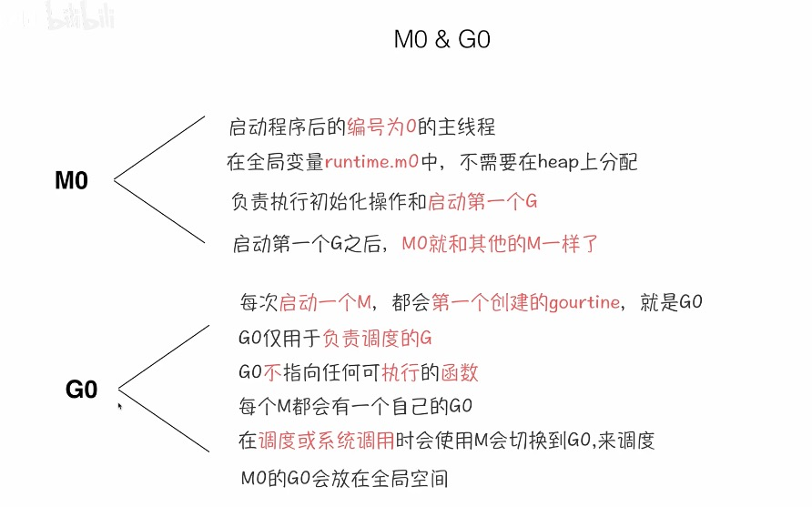

- [GMP](#gmp)
- [GOPATH](#gopath)
- [go interface底层，Go版本是1.25.1](#go-interface底层go版本是1251)
- [反射底层，Go版本是1.25.1](#反射底层go版本是1251)
- [底层数据类型，Go版本是1.25.1](#底层数据类型go版本是1251)
- [Go并发哲学](#go并发哲学)
- [context](#context)
- [CGO](#cgo)
- [泛型(https://segmentfault.com/a/1190000041634906)](#泛型httpssegmentfaultcoma1190000041634906)
- [slog](#slog)

#### GMP
   - M:N模型
   
   

   - GMP模型
  
   

   

   

   > GMP解释(https://hackmd.io/@zhegen/SJxZMkIdc)
   > 
   > go scheduler所采用的调度模型为GMP
   >
   > G: Goroutine，用户态协程，是由Go scheduler做context switch在M上面工作。Goroutine有三个状态:
   >
   > Waiting：代表Goroutine正在等待systemcall执行完毕，或是等待锁等。
   >
   > Runnable：代表Goroutine已经准备好被调度，等待着被分配到M上面去执行。
   >
   > Executing：代表Goroutine正在被M调度执行。
   >
   > M: Machine，实际是一个系统线程，操作系统调度的最小单元。预设最多可有10000个M。
   >
   > P: Processor，是一虚拟处理器，不代表真实的CPU core数量 ，这个数量在程序启动时候就被決定，这个也被代表着在process运行期间，最多同时只有P个goroutine在运行，可以用P來限制process的并发程度。M通常会比P更多一些，比如碰到阻塞的操作，P就会和M分离，如果有很多阻塞任务，M就可能会非常多。
   >
   > P 通常跟 CPU 核心数一样多，表示当前这个 go 程序可以占用几个 CPU 核心。
   > 
   > P 是需要绑定一个实际的 M 才能运行，毕竟系统线程才能真正的在物理 CPU 上执行任务。
   >
   > M 通常会比 P 更多一些，比如碰到阻塞的操作，P 就会和 M 分离，如果有很多阻塞任务，M 就可能会非常多。
   >
   > LRQ: Local Run Queue, 用來放置G，每个P都有自己的LRQ。
   >
   > GRQ: Global Run Queue，也是用來放置G，当有些LRQ满了之后，无法塞进更多G时，就会把G到GRQ里面。
   > 
   > 
   > 
   > M必须先取得一个P后，才能从P的LRQ中取得G來执行，若是LRQ为空，则会从GRQ或是其他P的LRQ拿G來放到本地P的LRQ里面，M拿到G，执行G，执行到某个时间点后，会进行context switch，把G放回LRQ，并从P拿下一个G执行，一直重复上述步骤。
   >
   > Handover
   > 
   > 当G1正在M1上执行时，遇到了需要呼叫blocking system call时，为提高系统性能，Go scheduler会执行一中Handover的机制，如以下。
   > 
   > 
   > 
   > 这时G1想要呼叫blocking system call，这时会将M1和P解除关联，并取得一个新的M(M2)来和原P进行关联，并继续执行LRQ內的G2。而M1则是继续负责G1的执行。
   > 
   > 
   >
   > 当G1执行system call完毕后，会被塞回LRQ，而M1则变成空闲状态，等待之后被P使用。
   >
   > 
   >
   > Work stealing
   > 
   > 如果有个P的LRQ已经空了，且M也沒有正在执行的G，那这个M因为进入到空闲状态很有可能被OS scheduler context switch掉，即使这个process中还有其他待执行的G。为了避免上述的情況发生，这时候Go scheduler会执行work stealing，从其他的P LRQ中或是GRQ中偷G。
   >
   > 一开始执行状态如下图
   > 
   > 
   > 
   > 而当M2把P2的G都执行完毕时候，且这个时候P1的LRQ也空了。
   > 
   > 
   > 
   > P1会尝试P2的LRQ偷一半的G，结果如下。
   > 
   > 
   >
   > 而当M2把P2的G都执行完毕时候，且这时候P1的LRQ也空了。
   > 
   > 
   > 
   > P2这时候会尝试从GRQ偷，如下。
   >
   > 

   - M0和G0
 
   

   
  
   
  
   

#### GOPATH
> 可以理解为工作目录，该目录下一般包含以下几个子目录：
> 
> - src：存放项目的Go代码
> - pkg：存放编译后的中间文件(根据不同的操作系统和架构，会有不同的子目录)
> - bin：存放编译后的可执行文件
>
> 将你的包或者别人的包全部放在```$GOPATH/src```目录下进行管理的方式，称之为```GOPATH```模式。在这个模式下，使用```go install```时，生成的可执行文件会放在```$GOPATH/bin```下。如果你安装的是一个库，则会生成中间文件到```$GOPATH/pkg```下对应的平台目录中。
>
> ```GOPATH```存在的问题主要是没有版本的概念，不同项目下无法使用多个版本库。

1. go vendor
> 为了解决```GOPATH```方案下不同项目下无法使用多个版本库的问题，Go v1.5开始支持```vendor```。
>
> 以前使用```GOPATH```的时候，所有的项目都共享一个```GOPATH```，需要导入依赖的时候，都来这里找，在```GOPATH```模式下只能有一个版本的第三方库。解决的思路就是，在每个项目下都创建一个```vendor```目录，每个项目所需的依赖都只会下载到自己```vendor```目录下，项目之间的依赖包互不影响。其搜索包的优先级顺序，由高到低是这样的:
> 
> 1.当前包下的```vendor```目录
> 
> 2.向上级目录查找，直到找到```src```下的```vendor```目录
> 
> 3.在```GOROOT```目录下查找
>
> 4.在```GOPATH```下面查找依赖包
>
> ```go vendor```存在的问题主要没有集中式管理，第三方包分散在不同目录中。

1. go mod
>
> 以当前项目为例，```go.mod```文件和```go.sum文件```。
> 
> ```go.mod```:
> 
> 第一行：模块的引用路径
> 
> 第二行：项目使用的版本
> 
> 第三行：项目所需的直接依赖包及其版本
>
> ```go.sum```:
>
> 每一行都是由```模块路径```，```模块版本```，```哈希检验值```组成，其中```哈希检验值```是用来保证当前缓存的模块不会被篡改。

#### go interface底层，Go版本是1.25.1
```GO
type _type = abi.Type
// 非空接口，带有方法的interface
type iface struct {
    // 描述非空接口类型数据
	tab  *itab
    // 指向具体数据的指针
	data unsafe.Pointer
}

// 空接口
type eface struct {
    // 接口对应具体对象的类型
	_type *_type
    // 指向具体数据的指针
	data  unsafe.Pointer
}

// 非空接口类型
type itab = abi.ITab
type ITab struct {
    // 接口类型
	Inter *InterfaceType
    // 接口对应具体对象的类型
	Type  *Type
	Hash  uint32     // copy of Type.Hash. Used for type switches.
	Fun   [1]uintptr // variable sized. fun[0]==0 means Type does not implement Inter.
}

// 所有类型最原始的元信息
type Type struct {
	Size_       uintptr
	PtrBytes    uintptr // number of (prefix) bytes in the type that can contain pointers
	Hash        uint32  // hash of type; avoids computation in hash tables
	TFlag       TFlag   // extra type information flags
	Align_      uint8   // alignment of variable with this type
	FieldAlign_ uint8   // alignment of struct field with this type
	Kind_       Kind    // enumeration for C
	// function for comparing objects of this type
	// (ptr to object A, ptr to object B) -> ==?
	Equal func(unsafe.Pointer, unsafe.Pointer) bool
	// GCData stores the GC type data for the garbage collector.
	// Normally, GCData points to a bitmask that describes the
	// ptr/nonptr fields of the type. The bitmask will have at
	// least PtrBytes/ptrSize bits.
	// If the TFlagGCMaskOnDemand bit is set, GCData is instead a
	// **byte and the pointer to the bitmask is one dereference away.
	// The runtime will build the bitmask if needed.
	// (See runtime/type.go:getGCMask.)
	// Note: multiple types may have the same value of GCData,
	// including when TFlagGCMaskOnDemand is set. The types will, of course,
	// have the same pointer layout (but not necessarily the same size).
	GCData    *byte
	Str       NameOff // string form
	PtrToThis TypeOff // type for pointer to this type, may be zero
}

// Go类型
type Kind uint8
const (
	Invalid Kind = iota
	Bool
	Int
	Int8
	Int16
	Int32
	Int64
	Uint
	Uint8
	Uint16
	Uint32
	Uint64
	Uintptr
	Float32
	Float64
	Complex64
	Complex128
	Array
	Chan
	Func
	Interface
	Map
	Pointer
	Slice
	String
	Struct
	UnsafePointer
)
// Go类型字符串
var kindNames = []string{
	Invalid:       "invalid",
	Bool:          "bool",
	Int:           "int",
	Int8:          "int8",
	Int16:         "int16",
	Int32:         "int32",
	Int64:         "int64",
	Uint:          "uint",
	Uint8:         "uint8",
	Uint16:        "uint16",
	Uint32:        "uint32",
	Uint64:        "uint64",
	Uintptr:       "uintptr",
	Float32:       "float32",
	Float64:       "float64",
	Complex64:     "complex64",
	Complex128:    "complex128",
	Array:         "array",
	Chan:          "chan",
	Func:          "func",
	Interface:     "interface",
	Map:           "map",
	Pointer:       "ptr",
	Slice:         "slice",
	String:        "string",
	Struct:        "struct",
	UnsafePointer: "unsafe.Pointer",
}

// Go数组类型
type ArrayType struct {
	Type
	Elem  *Type // array element type
	Slice *Type // slice type
	Len   uintptr
}

func (t *Type) Len() int {
	if t.Kind() == Array {
        // 内存模型和C一样
		return int((*ArrayType)(unsafe.Pointer(t)).Len)
	}
	return 0
}

// Go切片类型
type SliceType struct {
	Type
	Elem *Type // slice element type
}

// 其他Go类型可以看源码src/internal/abi/type.go
```
```Go
package main

import (
	"fmt"
	"io"
	"os"
)

func main() {
	var w io.Writer
	// true
	fmt.Println(w == nil)

	os_stdout := os.Stdout
	w = os_stdout
	// false
	fmt.Println(w == nil)

	var e any
	// true
	fmt.Println(e == nil)

	e = os_stdout
	// false
	fmt.Println(e == nil)
}
```


```Go
package main

import (
	"fmt"
)

type MyInterface interface {
   Print()
}

type MyStruct struct{}
func (ms MyStruct) Print() {}

func main() {
   a := 1
   b := "str"
   c := MyStruct{}
   var i1 interface{} = a
   var i2 interface{} = b
   var i3 MyInterface = c
   var i4 interface{} = i3
   var i5 = i4.(MyInterface)
   fmt.Println(i1, i2, i3, i4, i5)
}
```
```SHELL 
go build -gcflags '-N -l' -o tmp main.go

go tool objdump -s "main\.main" tmp
```
```ASM
  main.go:15            0x14009ee20             4c8da42410ffffff                LEAQ 0xffffff10(SP), R12
  main.go:15            0x14009ee28             4d3b6610                        CMPQ R12, 0x10(R14)
  main.go:15            0x14009ee2c             0f8629030000                    JBE 0x14009f15b
  main.go:15            0x14009ee32             55                              PUSHQ BP
  main.go:15            0x14009ee33             4889e5                          MOVQ SP, BP
  main.go:15            0x14009ee36             4881ec68010000                  SUBQ $0x168, SP
  main.go:16            0x14009ee3d             48c744241801000000              MOVQ $0x1, 0x18(SP)
  main.go:17            0x14009ee46             488d0de3610200                  LEAQ go:string.*+88(SB), CX
  main.go:17            0x14009ee4d             48894c2478                      MOVQ CX, 0x78(SP)
  main.go:17            0x14009ee52             48c784248000000003000000        MOVQ $0x3, 0x80(SP)

  // var i1 interface{} = a，构建eface
  main.go:20            0x14009ee5e             488b4c2418                      MOVQ 0x18(SP), CX
  // data unsafe.Pointer
  main.go:20            0x14009ee63             48894c2420                      MOVQ CX, 0x20(SP)
  main.go:20            0x14009ee68             488d0d71b90000                  LEAQ runtime.rodata+42976(SB), CX
  // _type *_type
  main.go:20            0x14009ee6f             48894c2468                      MOVQ CX, 0x68(SP)
  main.go:20            0x14009ee74             488d0d25e70400                  LEAQ runtime.gcbits.*(SB), CX
  main.go:20            0x14009ee7b             48894c2470                      MOVQ CX, 0x70(SP)
  
  // var i2 interface{} = b，构建eface
  // 字符串内存(内容+长度)
  main.go:21            0x14009ee80             488b4c2478                      MOVQ 0x78(SP), CX
  main.go:21            0x14009ee85             488b942480000000                MOVQ 0x80(SP), DX
  // data unsafe.Pointer
  main.go:21            0x14009ee8d             48898c2488000000                MOVQ CX, 0x88(SP)
  main.go:21            0x14009ee95             4889942490000000                MOVQ DX, 0x90(SP)
  main.go:21            0x14009ee9d             488d0dfcb60000                  LEAQ runtime.rodata+42400(SB), CX
  // _type *_type
  main.go:21            0x14009eea4             48894c2458                      MOVQ CX, 0x58(SP)
  main.go:21            0x14009eea9             488d0d00ee0400                  LEAQ runtime.buildVersion.str+16(SB), CX
  main.go:21            0x14009eeb0             48894c2460                      MOVQ CX, 0x60(SP)
  
  // var i3 MyInterface = c，构建iface
  main.go:22            0x14009eeb5             488d0d1cf40400                  LEAQ go:itab.main.MyStruct,main.MyInterface(SB), CX
  // tab  *itab
  main.go:22            0x14009eebc             48894c2448                      MOVQ CX, 0x48(SP)  
  main.go:22            0x14009eec1             488d15781d1200                  LEAQ runtime.zerobase(SB), DX
  // data unsafe.Pointer
  main.go:22            0x14009eec8             4889542450                      MOVQ DX, 0x50(SP)
  
  // var i4 interface{} = i3，从i3提取出data指针，然后和MyStruct对应*_type数据指针一起构建iface
  // 把i3的itab指针存到栈上的临时位置0xf8(SP)
  main.go:23            0x14009eecd             48898c24f8000000                MOVQ CX, 0xf8(SP)
  // 把i3的data指针存到栈上的临时位置0x100(SP)
  main.go:23            0x14009eed5             4889942400010000                MOVQ DX, 0x100(SP)
  main.go:23            0x14009eedd             48898c24f0000000                MOVQ CX, 0xf0(SP)
  main.go:23            0x14009eee5             eb00                            JMP 0x14009eee7
  main.go:23            0x14009eee7             488d0dd2200100                  LEAQ runtime.rodata+69568(SB), CX
  // MyStruct对应*_type存到栈上的临时位置0xf0(SP)
  main.go:23            0x14009eeee             48898c24f0000000                MOVQ CX, 0xf0(SP)
  main.go:23            0x14009eef6             eb00                            JMP 0x14009eef8
  main.go:23            0x14009eef8             488b8c2400010000                MOVQ 0x100(SP), CX
  main.go:23            0x14009ef00             488b9424f0000000                MOVQ 0xf0(SP), DX
  // _type *_type
  main.go:23            0x14009ef08             4889542438                      MOVQ DX, 0x38(SP)
  // data unsafe.Pointer
  main.go:23            0x14009ef0d             48894c2440                      MOVQ CX, 0x40(SP)

  // var i5 = i4.(MyInterface)
  main.go:25            0x14009ef12             440f11bc2458010000              MOVUPS X15, 0x158(SP)
  // i4 _type *_type
  main.go:25            0x14009ef1b             488b5c2438                      MOVQ 0x38(SP), BX
  // i4 data unsafe.Pointer
  main.go:25            0x14009ef20             488b4c2440                      MOVQ 0x40(SP), CX
  // _types是否为nil
  main.go:25            0x14009ef25             4885db                          TESTQ BX, BX
  main.go:25            0x14009ef28             7505                            JNE 0x14009ef2f
  main.go:25            0x14009ef2a             e91f020000                      JMP 0x14009f14e
  //i4 data unsafe.Pointer 临时保存到栈上的0x98(SP)位置
  main.go:25            0x14009ef2f             48898c2498000000                MOVQ CX, 0x98(SP)
  // 编译器会生成一个特殊的typeAssert结构体，里面包含了被断言的类型MyStruct和目标接口MyInterface的信息。把这个结构体的地址加载到AX寄存器
  main.go:25            0x14009ef37             488d0572460d00                  LEAQ main..typeAssert.0(SB), AX
  main.go:25            0x14009ef3e             6690                            NOPW
  // 这个函数会接收typeAssert结构体地址和i4的_type *_type为参数。如果断言成功，它会返回一个itab指针；如果失败，它会触发panic。
  main.go:25            0x14009ef40             e85b13f7ff                      CALL runtime.typeAssert(SB)
  main.go:25            0x14009ef45             eb00                            JMP 0x14009ef47
  main.go:25            0x14009ef47             4889842458010000                MOVQ AX, 0x158(SP)
  main.go:25            0x14009ef4f             488b942498000000                MOVQ 0x98(SP), DX
  main.go:25            0x14009ef57             4889942460010000                MOVQ DX, 0x160(SP)
  // i5 runtime.typeAssert返回的tab  *itab
  main.go:25            0x14009ef5f             4889442428                      MOVQ AX, 0x28(SP)
  // i5 data unsafe.Pointer
  main.go:25            0x14009ef64             4889542430                      MOVQ DX, 0x30(SP)
```

#### 反射底层，Go版本是1.25.1
   - reflect.TypeOf() 底层实现
   ```Go
    // TypeOf returns the abi.Type of some value.
    func TypeOf(a any) *Type {
        eface := *(*EmptyInterface)(unsafe.Pointer(&a))
        // Types are either static (for compiler-created types) or
        // heap-allocated but always reachable (for reflection-created
        // types, held in the central map). So there is no need to
        // escape types. noescape here help avoid unnecessary escape
        // of v.
        return (*Type)(NoEscape(unsafe.Pointer(eface.Type)))
    }

    // EmptyInterface describes the layout of a "interface{}" or a "any."
    // These are represented differently than non-empty interface, as the first
    // word always points to an abi.Type.
    type EmptyInterface struct {
        Type *Type
        Data unsafe.Pointer
    }
   ```

   - reflect.ValueOf() 底层实现
   ```Go
    type Value struct {
        // typ_ holds the type of the value represented by a Value.
        // Access using the typ method to avoid escape of v.
        typ_ *abi.Type

        // Pointer-valued data or, if flagIndir is set, pointer to data.
        // Valid when either flagIndir is set or typ.pointers() is true.
        ptr unsafe.Pointer

        // flag holds metadata about the value.
        //
        // The lowest five bits give the Kind of the value, mirroring typ.Kind().
        //
        // The next set of bits are flag bits:
        //	- flagStickyRO: obtained via unexported not embedded field, so read-only
        //	- flagEmbedRO: obtained via unexported embedded field, so read-only
        //	- flagIndir: val holds a pointer to the data
        //	- flagAddr: v.CanAddr is true (implies flagIndir and ptr is non-nil)
        //	- flagMethod: v is a method value.
        // If ifaceIndir(typ), code can assume that flagIndir is set.
        //
        // The remaining 22+ bits give a method number for method values.
        // If flag.kind() != Func, code can assume that flagMethod is unset.
        flag

        // A method value represents a curried method invocation
        // like r.Read for some receiver r. The typ+val+flag bits describe
        // the receiver r, but the flag's Kind bits say Func (methods are
        // functions), and the top bits of the flag give the method number
        // in r's type's method table.
    }

    // ValueOf returns a new Value initialized to the concrete value
    // stored in the interface i. ValueOf(nil) returns the zero Value.
    func ValueOf(i any) Value {
        if i == nil {
            return Value{}
        }
        return unpackEface(i)
    }

    // unpackEface converts the empty interface i to a Value.
    func unpackEface(i any) Value {
        e := (*abi.EmptyInterface)(unsafe.Pointer(&i))
        // NOTE: don't read e.word until we know whether it is really a pointer or not.
        t := e.Type
        if t == nil {
            return Value{}
        }
        f := flag(t.Kind())
        if t.IfaceIndir() {
            f |= flagIndir
        }
        return Value{t, e.Data, f}
    }
   ```

   - 反射三定律: 反射可以从接口值中得到反射对象
     
    
    
   

   - 反射三定律: 反射可以从反射对象中获得接口值
 
   

   ```Go
    // Interface returns v's current value as an interface{}.
    // It is equivalent to:
    //
    //	var i interface{} = (v's underlying value)
    //
    // It panics if the Value was obtained by accessing
    // unexported struct fields.
    func (v Value) Interface() (i any) {
        return valueInterface(v, true)
    }

    func valueInterface(v Value, safe bool) any {
	    if v.flag == 0 {
		    panic(&ValueError{"reflect.Value.Interface", Invalid})
	    }
	    if safe && v.flag&flagRO != 0 {
		    // Do not allow access to unexported values via Interface,
		    // because they might be pointers that should not be
		    // writable or methods or function that should not be callable.
		    panic("reflect.Value.Interface: cannot return value obtained from unexported field or method")
	    }
	    if v.flag&flagMethod != 0 {
		    v = makeMethodValue("Interface", v)
	    }

	    if v.kind() == Interface {
		    // Special case: return the element inside the interface.
		    return packIfaceValueIntoEmptyIface(v)
	    }

	    return packEface(v)
    }
   ```

   - 反射三定律: 若要修改反射对象，值必须可修改
   ```Go
    func main() {
        var x float64 = 3.4
        v := reflect.ValueOf(x)
        v.SetFloat(7.1) // Error: will panic.
    }
   ```
   调用```reflect.ValueOf```传进去的是一个值类型的变量，获得的```Value```其实是完全的值拷贝，这个```Value```是不能被修改的。如果传进去是一个指针，获得的```Value```是一个指针副本，但是这个指针指向的地址的对象是可以改变的。

   - 总结
  
   

#### 底层数据类型，Go版本是1.25.1
```Go
// Slice is the runtime representation of a slice.
// It cannot be used safely or portably and its representation may
// change in a later release.
//
// Unlike reflect.SliceHeader, its Data field is sufficient to guarantee the
// data it references will not be garbage collected.
type Slice struct {
	Data unsafe.Pointer
	Len  int
	Cap  int
}

// String is the runtime representation of a string.
// It cannot be used safely or portably and its representation may
// change in a later release.
//
// Unlike reflect.StringHeader, its Data field is sufficient to guarantee the
// data it references will not be garbage collected.
type String struct {
	Data unsafe.Pointer
	Len  int
}

// Index returns v's i'th element.
// It panics if v's Kind is not [Array], [Slice], or [String] or i is out of range.
func (v Value) Index(i int) Value {
	switch v.kind() {
	case Array:
		tt := (*arrayType)(unsafe.Pointer(v.typ()))
		if uint(i) >= uint(tt.Len) {
			panic("reflect: array index out of range")
		}
		typ := tt.Elem
		offset := uintptr(i) * typ.Size()

		// Either flagIndir is set and v.ptr points at array,
		// or flagIndir is not set and v.ptr is the actual array data.
		// In the former case, we want v.ptr + offset.
		// In the latter case, we must be doing Index(0), so offset = 0,
		// so v.ptr + offset is still the correct address.
		val := add(v.ptr, offset, "same as &v[i], i < tt.len")
		fl := v.flag&(flagIndir|flagAddr) | v.flag.ro() | flag(typ.Kind()) // bits same as overall array
		return Value{typ, val, fl}

	case Slice:
		// Element flag same as Elem of Pointer.
		// Addressable, indirect, possibly read-only.
		s := (*unsafeheader.Slice)(v.ptr)
		if uint(i) >= uint(s.Len) {
			panic("reflect: slice index out of range")
		}
		tt := (*sliceType)(unsafe.Pointer(v.typ()))
		typ := tt.Elem
		val := arrayAt(s.Data, i, typ.Size(), "i < s.Len")
		fl := flagAddr | flagIndir | v.flag.ro() | flag(typ.Kind())
		return Value{typ, val, fl}

	case String:
		s := (*unsafeheader.String)(v.ptr)
		if uint(i) >= uint(s.Len) {
			panic("reflect: string index out of range")
		}
		p := arrayAt(s.Data, i, 1, "i < s.Len")
		fl := v.flag.ro() | flag(Uint8) | flagIndir
		return Value{uint8Type, p, fl}
	}
	panic(&ValueError{"reflect.Value.Index", v.kind()})
}
```
数组没有专属底层数据结构，应该就是一个连续的内存块
```Go
package main

import (
	"fmt"
	"unsafe"
)

func main() {
	var s = make([]int, 0, 20)
	for i := 0; i < 10; i++ {
		s = append(s, i)
	}
	pArrAddress := *(*unsafe.Pointer)(unsafe.Pointer(&s))
	pArr := (*[20]int)(pArrAddress)
	pLen := (*int)(unsafe.Pointer(uintptr(unsafe.Pointer(&s)) + uintptr(8)))
	pCap := (*int)(unsafe.Pointer(uintptr(unsafe.Pointer(&s)) + uintptr(16)))
	// 10 20 [0 1 2 3 4 5 6 7 8 9 0 0 0 0 0 0 0 0 0 0]
	fmt.Println(*pLen, *pCap, *pArr)

	type Rect struct {
		Width  int
		Height int
	}
	var r = Rect{50, 50}
	var i any = r
	p := *(*[2]*Rect)(unsafe.Pointer(&i))
	r.Height = 100
	r.Width = 100
	// 50 50
	fmt.Println(p[1].Width, p[1].Height)
	r2 := i.(Rect)
	// 0xc00000a0c0 0xc00000a0b0 0xc00000a0d0
	fmt.Println(unsafe.Pointer(p[1]), unsafe.Pointer(&r), unsafe.Pointer(&r2))
}
```

#### Go并发哲学
> Do not communicate by sharing memory; instead, share memory by communicating.
> 
> [如何理解 Golang 中“不要通过共享内存来通信，而应该通过通信来共享内存”？](https://www.zhihu.com/question/58004055)
>
> 从架构上来讲，降低共享内存的使用，本来就是解耦和的重要手段之一，举几个例子
> 
> 案例：MMORPG AOI 模块
> MMORPG 服务器逻辑依赖实时计算 AOI，AOI计算模块需要实时告诉其他模块，对于某个玩家：
>
> 1.有哪些人进入了我的视线范围？
> 
> 2.有哪些人离开了我的视线范围？
> 
> 3.区域内的角色发生了些什么事情？
> 
> 
>
> 所有逻辑都依赖上述计算结果，因此角色有动作的时候才能准确的通知到对它感兴趣的人。这个计算很费 CPU，特别是 ARPG跑来跑去那种，一般放在另外一个线程来做，但这个模块又需要频繁读取各个角色之间的位置信息和一些用户基本资料。
>
> 最早的做法就是简单的加锁：
>
> 第一是对主线程维护的用户位置信息加锁，保证AOI模块读取不会出错。
>
> 第二是对AOI模块生成的结果数据加锁，方便主线程访问。
>
> 如此代码得写的相当小心，性能问题都不说了，稍有不慎状态就会弄挂，写一处代码要经常回过头去看另外一处是怎么写的，担心自己这样写会不会出错。新人加入后，经常因为漏看老代码，考虑少了几处情况，弄出问题来你还要定位一半天难以查证。
>
> 演进后的合理做法当然是 AOI和主线程之间不再有共享内存，主线程维护玩家上线下线和移动，那么它会把这些变化情况抄一份用消息发送给 AOI模块，AOI模块根据这些消息在内部构建出另外一份完整的玩家数据，自己访问不必加锁；计算好结果后，又用消息投递给主线程，主线程根据AOI模块的消息自己在内存中构建出一份AOI结果数据来，自己频繁访问也不需要加锁。
>
> 由此AOI模块得以完全脱离游戏，单独开发优化，相互之间的偶合已经降低到只有消息级别的了，由于AOI并不需要十分精密的结果，主线程针对角色位置变化不必要每次都通知AOI，隔一段时间（比如0.2秒）通知下变动情况即可。而两个线程都需要频繁的访问全局玩家坐标信息，这样各自维护一份以后，将“高频率的访问” 这个动作限制在了各自线程自己的私有数据中，完全避免了锁冲突和逻辑状态冲突。
>
> 用一定程度的数据冗余，换取了较低的模块偶合。出问题概率大大降低，可靠性也上升了，每个模块还可以单独的开发优化。
>
> 做的事情都是把原来共享内存干掉，重新设计了以消息为主的接口方式，各自维护一份数据，以一定程度的数据冗余换取了更低的代码偶合，提升了性能和稳定性还有可维护性。
>
> 很多教多线程编程的书讲完多线程就讲数据锁，给人一个暗示好像以后写程序也是这样，建立了一个线程，接下来就该考虑数据共享访问的事情了。所以Erlang的成功就是给这些老模式很好的举了个反例。
>
> 所以 “减少共享内存” 和多用　“消息”，并不单单是物理分布问题，这本来就是一种良好的编程模型。它不仅针对数据，代码结构设计也同样实用，有时候不要总想着抽象点什么，弄出一大堆 Base Object/Inerface 的后果有时候是灾难性的。不同模块内部做一定程度的冗余代码，有时反而能让整个项目逻辑更加清晰起来。
>
> 所以才会说：高内聚低耦合嘛

#### context
> 在Go服务中，往往由一个独立的goroutine去处理一次请求，但在这个goroutine中，可能会开启别的goroutine去执行一些具体的事务，如数据库，RPC等，同时，这一组goroutine可能还需要共同访问一些特殊的值，如用户token, 请求过期时间等，当一个请求超时后，我们希望与此请求有关的所有goroutine都能快速退出，以回收系统资源。所以我们需要一种可以跟踪goroutine的方案，才可以达到控制他们的目的，这就是 Go语言为我们提供的Context，称之为上下文非常贴切，它就是goroutine的上下文。
>
```Go
package main

import (
	"context"
	"fmt"
	"time"
)

func useContext(ctx context.Context, idStr string) {
	for {
		select {
		case <-ctx.Done():
			fmt.Println("useContext stop", idStr)
			return
		case <-time.After(time.Second):
			fmt.Println("running,", idStr)
		}
	}
}

func G1_1(ctx context.Context) {
	useContext(ctx, "G1_1")
}

func G1(ctx context.Context) {
	nCtx, nStop := context.WithCancel(ctx)

	go G1_1(nCtx)

	for {
		select {
		case <-ctx.Done():
			fmt.Println("G1 stop")
			nStop()
			return
		case <-time.After(time.Second):
			fmt.Println("running, G1")
		}
	}
}

func G2(ctx context.Context) {
	tCtx, _ := context.WithTimeout(ctx, time.Second*3)
	useContext(tCtx, "G2")
}

func G3(ctx context.Context) {
	tCtx, _ := context.WithTimeout(ctx, time.Second*2)

	for {
		select {
		case <-tCtx.Done():
			fmt.Println("G3 stop")
			return
		case <-time.After(time.Second):
			fmt.Println("running,", "G3,", tCtx.Value(userKey))
		}
	}
}

type key int

var userKey key

func main() {
	wCtx := context.WithValue(context.Background(), userKey, "value")
	ctx, done := context.WithCancel(wCtx)

	go G1(ctx)
	go G2(ctx)
	go G3(ctx)

	// 等待10秒
	time.Sleep(10 * time.Second)
	// 关闭父上下文
	done()
	// 等待10秒，目的是等待其他goroutine结束
	time.Sleep(10 * time.Second)
}
```

源码, Go版本是1.25.1 

```Go
// context取消接口，定义了两个方法
type canceler interface {
    // 取消context，removeFromParent是否从父节点中删除
    // 一般而言，主动调用取消，removeFromParent设置为true，
    // 而被动取消，removeFromParent设置为false
    cancel(removeFromParent bool, err, cause error)
    // 是否可以结束channel
    Done() <-chan struct{}
}

// 描述conext接口
type stringer interface {
    String() string
}

// 上下文接口
type Context interface {
    // 过期时间，是否设置了过期时间
    Deadline() (deadline time.Time, ok bool)
    // 是否可以结束channel
    Done() <-chan struct{}
    // Done结束以后用来返回为什么结束
    Err() error
    // 返回context中的对应key的值
    Value(key any) any
}

// 安全地回溯找出父Context底层的*cancelCtx结构体，目的是将子context注册到父Conext子列表中 或者 将子Context从父Context子列表中删除
func parentCancelCtx(parent Context) (*cancelCtx, bool) {
    // 对于各种实现上下文而言，都有一个父Context，父Context本身如果没有实现Done，那就继续在父Context.父Context中是否实现了Done，
    // 直到找到实现了Done的Context，或者找到根Context(Background或TODO)。
    // 上面的描述可以理解为: 回溯链中返回最近祖先cancelCtx中的done channel。
    // 但如果Context树中有第三方实现的Context接口的实例时，parent.Done()就有可能返回其他channel。
	done := parent.Done()
    // 父Context已经被取消了 或者 永远不会取消，在这种情况下，子Context不需要注册，因为它会立即被取消
	if done == closedchan || done == nil {
		return nil, false
	}

    // 上面不是说存在第三方实现Context接口的实例时，parent.Done()就有可能返回其他channel。
    // 这里再通过下面函数方式获取done，返回最近祖先cancelCtx中的done channel。
	p, ok := parent.Value(&cancelCtxKey).(*cancelCtx)
	if !ok {
		return nil, false
	}
	pdone, _ := p.done.Load().(chan struct{})
	if pdone != done {
        // 说明有第三方实现
		return nil, false
	}
	return p, true
}

// 从父Context中删除子Context
func removeChild(parent Context, child canceler) {
    // 这肯定是第三方实现Context，显示调用stop就行
	if s, ok := parent.(stopCtx); ok {
		s.stop()
		return
	}
    // 安全地回溯找出父Context底层的*cancelCtx结构体，目的是将子context注册到父Conext子列表中 或者 将子Context从父Context子列表中删除
	p, ok := parentCancelCtx(parent)
	if !ok {
		return
	}
	p.mu.Lock()
	if p.children != nil {
        // 会将当前节点的context从父节点context中删除
		delete(p.children, child)
	}
	p.mu.Unlock()
}

// ctx取消或者主动调用返回stop函数，将会在新的协程中回调f
func AfterFunc(ctx Context, f func()) (stop func() bool) {
	a := &afterFuncCtx{
		f: f,
	}
	a.cancelCtx.propagateCancel(ctx, a)
	return func() bool {
		stopped := false
		a.once.Do(func() {
			stopped = true
		})
		if stopped {
			a.cancel(true, Canceled, nil)
		}
		return stopped
	}
}

// 第三方实现Context如果有实现AfterFunc，说白了Context树需要自己维护，就是说关联和级联取消都需要自己实现
type afterFuncer interface {
    // 参数func是当第三方实现Context取消或者主动调用返回stop函数，会执行
	AfterFunc(func()) func() bool
}

// 服务于第三方实现Context并且实现AfterFunc方法
type stopCtx struct {
    // 父Context
	Context
    // 用来取消当前Context的函数
    stop func() bool
}

// 取消Context，执行用户函数
type afterFuncCtx struct {
    // 内嵌标准 cancelCtx，继承其所有方法和属性
	cancelCtx
    // 只执行一次
	once sync.Once
    // 用户函数
	f    func()
}

// 取消Context
func (a *afterFuncCtx) cancel(removeFromParent bool, err, cause error) {
	a.cancelCtx.cancel(false, err, cause)
	if removeFromParent {
		removeChild(a.Context, a)
	}
	a.once.Do(func() {
        // 发起协程执行，上级加锁了，避免力度太大
		go a.f()
	})
}


type emptyCtx struct{}
// ok为false表示没有设置过期时间
func (emptyCtx) Deadline() (deadline time.Time, ok bool) {
    return
}
// 用nil初始化out channel，用户读取将会阻塞
func (emptyCtx) Done() <-chan struct{} {
    return nil
}
// 什么Done，永远是nil
func (emptyCtx) Err() error {
    return nil
}
// context中的对应key的值永远是nil
func (emptyCtx) Value(key any) any {
    return nil
}

// 一般用于整个Context树的根节点
type backgroundCtx struct{ emptyCtx }
type todoCtx struct{ emptyCtx }
func Background() Context {
    return backgroundCtx{}
}
func TODO() Context {
    return todoCtx{}
}

// 可以取消的Context，实现了: Context, canceler, stringer
type cancelCtx struct {
    // parent
    Context
    // 保护下面字段，确保并发安全
    mu       sync.Mutex 
    // 原子性，确保并发安全，里面是chan struct{}
    // 这里用原子性的目的是提高性能，其实下面的接口就可以看出来
    done     atomic.Value
    // 孩子
    children map[canceler]struct{}
    // 原子性，确保并发安全，里面是error，done的内部原因
    // 这里用原子性的目的是提高性能，其实下面的接口就可以看出来
    err      atomic.Value
    // 外部调用cancel时传递的错误
    cause    error
}

// 返回回溯链Context中key对应value
func (c *cancelCtx) Value(key any) any {
    if key == &cancelCtxKey {
        return c
    }
    return value(c.Context, key)
}

// 保证并发安全地创建并返回done通道
func (c *cancelCtx) Done() <-chan struct{} {
    // 懒惰初始化，第一次检查，无锁
    d := c.done.Load()
    if d != nil {
        return d.(chan struct{})
    }
    // 第二次检查，有锁
    c.mu.Lock()
    defer c.mu.Unlock()
    d = c.done.Load()
    if d == nil {
        d = make(chan struct{})
        c.done.Store(d)
    }
    return d.(chan struct{})
}

// 返回done的内部原因
func (c *cancelCtx) Err() error {
    // An atomic load is ~5x faster than a mutex, which can matter in tight loops.
    if err := c.err.Load(); err != nil {
        return err.(error)
    }
    return nil
}

// 返回带有层级的context描述，n代父亲描述.n-1代父亲描述. ... .父亲描述.WithCancel
func (c *cancelCtx) String() string {
    return contextName(c.Context) + ".WithCancel"
}

// 确保子Context在父Context被取消时也自动被取消
func (c *cancelCtx) propagateCancel(parent Context, child canceler) {
    c.Context = parent

    // 对于各种实现上下文而言，都有一个父Context，父Context本身如果没有实现Done，那就继续在父Context.父Context中是否实现了Done，
    // 直到找到实现了Done的Context，或者找到根Context(Background或TODO)。
    // 上面的描述可以理解为: 回溯链中返回最近祖先cancelCtx中的done channel。
    // 但如果Context树中有第三方实现的Context接口的实例时，parent.Done()就有可能返回其他channel。
    done := parent.Done()
    if done == nil {
        // 父Context永远不会取消，直接返回即可
        return
    }

    // 非阻塞检查
    select {
    case <-done:
        // 父Context已经被取消，子Context也需要取消
        child.cancel(false, parent.Err(), Cause(parent))
        return
    default:
    }

    // 安全地回溯找出父Context底层的*cancelCtx结构体，目的是将子context注册到父Conext子列表中 或者 将子Context从父Context子列表中删除
    if p, ok := parentCancelCtx(parent); ok {
        // parent is a *cancelCtx, or derives from one.
        p.mu.Lock()
        if err := p.err.Load(); err != nil {
            // parent has already been canceled
            child.cancel(false, err.(error), p.cause)
        } else {
            if p.children == nil {
                p.children = make(map[canceler]struct{})
            }
            p.children[child] = struct{}{}
        }
        p.mu.Unlock()
        return
    }

    // 没找到，能走到这里一般都是父亲第三方实现Context，返回了其他done channel

    // 如果父亲第三方实现了AfterFunc方法，
    if a, ok := parent.(afterFuncer); ok {
        // parent implements an AfterFunc method.
        c.mu.Lock()
        // 说白了就是，父亲取消的时候，孩子也要取消
        stop := a.AfterFunc(func() {
            child.cancel(false, parent.Err(), Cause(parent))
        })
        c.Context = stopCtx{
            Context: parent,
            stop:    stop,
        }
        c.mu.Unlock()
        return
    }

    // 通用兜底方案，当父Context既不是标准cancelCtx，也没有实现afterFuncer接口时使用，
    // 则会启动一个goroutine，监听父Context的Done channel，一旦父Context被取消，子Context也会被取消。
    // 或者，孩子Context被取消，这个监听协程就会结束
    goroutines.Add(1)
    go func() {
        select {
        case <-parent.Done():
            child.cancel(false, parent.Err(), Cause(parent))
        case <-child.Done():
        }
    }()
}

// Context取消
// removeFromParent是否从父节点中删除
func (c *cancelCtx) cancel(removeFromParent bool, err, cause error) {
	if err == nil {
		panic("context: internal error: missing cancel error")
	}
	if cause == nil {
		cause = err
	}
	c.mu.Lock()
	if c.err.Load() != nil {
		c.mu.Unlock()
        // 已经被其他 goroutine 取消
		return // already canceled
	}
	c.err.Store(err)
	c.cause = cause
    // 关闭done channel
	d, _ := c.done.Load().(chan struct{})
	if d == nil {
		c.done.Store(closedchan)
	} else {
		close(d)
	}
    // 级联取消
	for child := range c.children {
		// NOTE: acquiring the child's lock while holding parent's lock.
		child.cancel(false, err, cause)
	}
	c.children = nil
	c.mu.Unlock()

	if removeFromParent {
		removeChild(c.Context, c)
	}
}

type CancelFunc func()
// cancelCtx, 取消函数
func WithCancel(parent Context) (ctx Context, cancel CancelFunc) {
	c := withCancel(parent)
	return c, func() { c.cancel(true, Canceled, nil) }
}
type CancelCauseFunc func(cause error)
// cancelCtx, 带外部原因参数取消函数
func WithCancelCause(parent Context) (ctx Context, cancel CancelCauseFunc) {
	c := withCancel(parent)
	return c, func(cause error) { c.cancel(true, Canceled, cause) }
}
// 生成cancelCtx
func withCancel(parent Context) *cancelCtx {
	if parent == nil {
		panic("cannot create context from nil parent")
	}
	c := &cancelCtx{}
    // 确保子Context在父Context被取消时也自动被取消
	c.propagateCancel(parent, c)
	return c
}
```

#### CGO 
> 要使用 CGO 特性，需要安装 C/C++ 构建工具链，在 macOS 和 Linux 下是要安装 GCC，在 windows 下是需要安装 MinGW 工具。同时需要保证环境变量 CGO_ENABLED 被设置为 1，这表示 CGO 是被启用的状态。

   - 启用CGO
   > import "C"，导入一个伪包C。随后，Go代码即可引用诸如C.size_t之类的类型、C.stdout之类的变量，或C.putchar之类的函数。
   
   - preamble
   > 通过import "C"语句启用CGO，CGO 会将紧跟的上一行代码所处注释块的内容视为C代码块，被称为序文(preamble)。例如：
   ```Go
   // #include <stdio.h>
   // #include <errno.h>
   import "C"
   ```
   > 序文部分可包含任意C语言代码，包括函数声明与变量声明。这些内容可在Go代码中被引用，如同它们定义在C包中一般。前言中声明的所有名称均可使用，即使其以小写字母开头。例外情况：前言中的静态变量不可在Go代码中被引用；静态函数则允许使用。

   - 编译选项
   > 同样实在徐文中编写，比如
   ```Go
   // #cgo CFLAGS: -DPNG_DEBUG=1
   // #cgo amd64 386 CFLAGS: -DX86=1
   // #cgo LDFLAGS: -lpng  
   // #include <png.h>
   import "C"
   ```
   ```Go
    package main

    /*
    #cgo windows,lua547 CFLAGS: -DCGO_OS_WINDOWS=1
    #cgo darwin,lua547 CFLAGS: -DCGO_OS_DARWIN=1
    #cgo linux,lua547 CFLAGS: -DCGO_OS_LINUX=1

    #if defined(CGO_OS_WINDOWS)
        const char* os = "windows";
    #elif defined(CGO_OS_DARWIN)
        const char* os = "darwin";
    #elif defined(CGO_OS_LINUX)
        const char* os = "linux";
    #else
    #	error(unknown os)
    #endif
    */
    import "C"

    func main() {
        print(C.GoString(C.os))
    }
   ```

   - build tag 
   > build tag 是在 Go 或 cgo 环境下的 C/C++ 文件开头的一种特殊的注释。条件编译类似于前面通过 #cgo 指令针对不同平台定义的宏，只有在对应平台的宏被定义之后才会构建对应的代码。但是通过 #cgo 指令定义宏有个限制，它只能是基于 Go 语言支持的 windows、darwin 和 linux 等已经支持的操作系统。如果我们希望定义一个 DEBUG 标志的宏，#cgo 指令就无能为力了。而 Go 语言提供的 build tag 条件编译特性则可以简单做到。
   ```Go
    //go:build linux,386 darwin,!cgo
   ```
   > 意味着这个 Go 源文件将在以下任何一种条件满足时被 Go 编译器包含：
   >
   > 操作系统为 Linux 且架构为 386
   > 
   > 操作系统为 Darwin（macOS）且 CGO 未被启用

   - 数值类型映射关系

| C 语言类型 | CGO 类型 | Go 语言类型 |
| :-----| ----: | :----: |
| char | C.char | byte |
| signed char | C.schar | int8 |
| unsigned char | C.uchar | uint8 |
| short | C.short | int16 |
| unsigned short | C.ushort | uint16 |
| int | C.int | int32 |
| unsigned int | C.uint | uint32 |
| long | C.long | int32 |
| unsigned long | C.ulong | uint32 |
| long long int | C.longlong | int64 |
| unsigned long long int | C.ulonglong | uint64 |
| float | C.float | float32 |
| double | C.double | float64 |
| size_t | C.size_t | uint |
| int8_t | C.int8_t | int8 |
| uint8_t | C.uint8_t | uint8 |
| int16_t | C.int16_t | int16 |
| uint16_t | C.uint16_t | uint16 |
| int32_t | C.int32_t | int32 |
| uint32_t | C.uint32_t | uint32 |
| int64_t | C.int64_t | int64 |
| uint64_t | C.uint64_t | uint64 |
   ```C
    // Go string to C string
    // The C string is allocated in the C heap using malloc.
    // It is the caller's responsibility to arrange for it to be
    // freed, such as by calling C.free (be sure to include stdlib.h
    // if C.free is needed).
    func C.CString(string) *C.char

    // Go []byte slice to C array
    // The C array is allocated in the C heap using malloc.
    // It is the caller's responsibility to arrange for it to be
    // freed, such as by calling C.free (be sure to include stdlib.h
    // if C.free is needed).
    func C.CBytes([]byte) unsafe.Pointer

    // C string to Go string
    func C.GoString(*C.char) string

    // C data with explicit length to Go string
    func C.GoStringN(*C.char, C.int) string

    // C data with explicit length to Go []byte
    func C.GoBytes(unsafe.Pointer, C.int) []byte
   ```

   - Go中一些类型在C中也有对应的类型
   ```C
    // _cgo_export.h
    #ifndef GO_CGO_EXPORT_PROLOGUE_H
    #define GO_CGO_EXPORT_PROLOGUE_H

    #ifndef GO_CGO_GOSTRING_TYPEDEF
    typedef struct { const char *p; ptrdiff_t n; } _GoString_;
    extern size_t _GoStringLen(_GoString_ s);
    extern const char *_GoStringPtr(_GoString_ s);
    #endif

    #endif 

    typedef signed char GoInt8;
    typedef unsigned char GoUint8;
    typedef short GoInt16;
    typedef unsigned short GoUint16;
    typedef int GoInt32;
    typedef unsigned int GoUint32;
    typedef long long GoInt64;
    typedef unsigned long long GoUint64;
    typedef GoInt64 GoInt;
    typedef GoUint64 GoUint;
    typedef size_t GoUintptr;
    typedef float GoFloat32;
    typedef double GoFloat64;

    #ifndef GO_CGO_GOSTRING_TYPEDEF
    typedef _GoString_ GoString;
    #endif
    typedef void *GoMap;
    typedef void *GoChan;
    typedef struct { void *t; void *v; } GoInterface;
    typedef struct { void *data; GoInt len; GoInt cap; } GoSlice;
   ```

   - 结构体、联合、枚举类型
   ```Go
    /*
    struct A {
        int i;
        float f;
    };
    */
    import "C"
    import "fmt"

    func main() {
        var a C.struct_A
        fmt.Println(a.i)
        fmt.Println(a.f)
    }
   ```
   ```Go
    /*
    struct A {
        int type; // type 是 Go 语言的关键字
    };
    */
    import "C"
    import "fmt"

    func main() {
        var a C.struct_A
        fmt.Println(a._type) // _type 对应 type
    }   
   ```
   ```Go
    /*
    struct A {
        int   type;  // type 是 Go 语言的关键字
        float _type; // 将屏蔽 CGO 对 type 成员的访问
    };
    */
    import "C"
    import "fmt"

    func main() {
        var a C.struct_A
        fmt.Println(a._type) // _type 对应 _type
    }
   ```
   ```Go
    /*
    struct A {
        int   size: 10; // 位字段无法访问
        float arr[];    // 零长的数组也无法访问
    };
    */
    import "C"
    import "fmt"

    func main() {
        var a C.struct_A
        fmt.Println(a.size) // 错误: 位字段无法访问
        fmt.Println(a.arr)  // 错误: 零长的数组也无法访问
    }
   ```
   ```Go
    /*
    #include <stdint.h>

    union B {
        int i;
        float f;
    };
    */
    import "C"
    import "fmt"

    func main() {
        var b C.union_B;
        fmt.Println("b.i:", *(*C.int)(unsafe.Pointer(&b)))
        fmt.Println("b.f:", *(*C.float)(unsafe.Pointer(&b)))
    }
   ```
   ```Go
    /*
    #include <stdint.h>

    union B1 {
        int i;
        float f;
    };

    union B2 {
        int8_t i8;
        int64_t i64;
    };
    */
    import "C"
    import "fmt"

    func main() {
        var b1 C.union_B1;
        fmt.Printf("%T\n", b1) // [4]uint8

        var b2 C.union_B2;
        fmt.Printf("%T\n", b2) // [8]uint8
    }   
   ```
   ```Go
    /*
    enum C {
        ONE,
        TWO,
    };
    */
    import "C"
    import "fmt"

    func main() {
        var c C.enum_C = C.TWO
        fmt.Println(c)
        fmt.Println(C.ONE)
        fmt.Println(C.TWO)
    }
   ```

   - Go 调用 C 函数
   ```Go
    /*
    #include <errno.h>

    static int div(int a, int b) {
        if(b == 0) {
            errno = EINVAL;
            return 0;
        }
        return a/b;
    }
    */
    import "C"
    import "fmt"

    func main() {
        v0, err0 := C.div(2, 1)
        // 2 <nil>
        fmt.Println(v0, err0)

        v1, err1 := C.div(1, 0)
        // 0 invalid argument
        fmt.Println(v1, err1)
    }
   ```

   - C 调用 Go
   ```Go
    package main

    //#include <stdlib.h>
    //void SayHello(char* s);
    import "C"

    import (
        "fmt"
        "unsafe"
    )

    func main() {
        szStr := C.CString("Hello, World\n")
        defer C.free(unsafe.Pointer(szStr))

        C.SayHello(szStr)
    }

    //export SayHello
    func SayHello(s *C.char) {
        fmt.Print(C.GoString(s))
    }
   ```

   - 传递指针存在问题
   > Go是一种具有垃圾回收机制的语言，垃圾回收器需要知道指向Go内存的每个指针的位置。因此，在Go和C之间传递指针存在限制。
   >
   > Go调用C Code时，Go传递给C Code的Go指针所指的Go Memory中不能包含任何指向Go Memory的Pointer。因为后者指向Go Memory的指针有可能移动，前者Go指针在调用期间会被隐式固定。
   >
   > 如果写出上述代码，就会运行时报错：panic runtime error: cgo argument has Go pointer to Go pointer。如下例子所:
   ```Go
    package main

    /*
    #include <stdio.h>
    struct Foo {
        int a;
        int *p;
    };

    void plusOne(struct Foo *f) {
        (f->a)++;
        *(f->p)++;
    }
    */
    import "C"
    import "unsafe"
    import "fmt"

    func main() {
        f := &C.struct_Foo{}
        f.a = 5
        f.p = (*C.int)((unsafe.Pointer)(new(int)))
        // f.p = &f.a

        C.plusOne(f)
        fmt.Println(int(f.a))
    }
   ```
   >  Go 1.21 版本，新增runtime.Pinner，用来​​手动​​告诉 Go 的垃圾回收器："​这块内存我现在要交给 C 代码了，在我说可以之前，你不要移动或回收它​​。
   ```Go
    package main

    /*
    #include <stdio.h>
    struct Foo {
        int a;
        int *p;
    };

    void plusOne(struct Foo *f) {
        (f->a)++;
        *(f->p)++;
    }
    */
    import "C"
    import (
        "fmt"
        "runtime"
        "unsafe"
    )

    func main() {
        f := &C.struct_Foo{}
        f.a = 5
        f.p = (*C.int)((unsafe.Pointer)(new(int)))
        // f.p = &f.a

        var pinner runtime.Pinner
        defer pinner.Unpin()
        pinner.Pin(f.p)

        C.plusOne(f)
        fmt.Println(int(f.a))
    }   
   ```
   
   - 内部机制
   > 常规编译 Go 代码，就是编译 + 链接，这两步。CGO编译多了一步，预编译，可以使用`go tool cgo`命令来预编译C代码。

   
   
   > 总结：
   > 1. Go=>C/Go=>C=>Go，其实就是system call的调度过程，需要切换g0栈，剩下就是正常的Go调度，GM和P分离，GM完成system call后，切换回g栈，会绑定 oldp 恢复执行，绑定其他空闲的 P 恢复执行，放回到运行队列等待调度。
   > 2. C=>Go，这个比较复杂，c是宿主，go是脚本，c的线程被迫参与了Go的调度，存在可能被挂起。
   > 
   > Go=>C
   >
   > 1）entersyscall() 将当前的 M 与 P 剥离，防止 C 程序独占 M 时，阻塞 P 的调度。
   > 
   > 2）asmcgocall() 将栈切换到 g0 的系统栈，并执行 C 函数调用
   >
   > 3）exitsyscall()寻找合适的 P 来运行从 C 函数返回的 Go 程，优先选择调用 C 之前依附的 P，其次选择其他空闲的 P

   

   

   > C=>Go, go -> C -> go
   > 
   > 本来就存在GMP环境，当M中的任务（syscall or C function call）完成后继续运行的，会执行到 exitsyscall。此时会按照这个顺序去执行：绑定 oldp 恢复执行，绑定其他空闲的 P 恢复执行，放回到运行队列等待调度。

   > C=>Go, 原生 C 调用 go(https://uncledou.site/2021/go-cgo/)
   ```Go
    package main

    import "C"

    //export AddFromGo
    func AddFromGo(a int64, b int64) int64 {
        return a + b
    }

    func main() {}
   ```
   ```SHELL
   go build -o libgo-hello.dll -buildmode=c-shared hello.go
   ```
   ```C
    #include <stdio.h>
    #include "libgo-hello.h"

    int main() {
        long a = 2;
        long b = 3;

        long r1 = AddFromGo(a, b);

        printf("%ld + %ld = %ld\n", a, b, r1);
    }
   ```
   ```SHELL
   gcc -g -o hello hello.c -l go-hello -L. "-Wl,-rpath,."
   ```
   ```
   PS C:\Users\Administrator\Desktop\go> .\hello.exe
   2 + 3 = 5
   ```
   > 执行流程
   > 
   > 1. main
   > 2. AddFromGo (libgo-hello.so 导出的函数，将函数参数写入到内存，一个 struct 中)
   > 3. crosscall2 (准备进入 cgocallback 这个 go 函数，对接两边的 call ABI)
   > 4. runtime.cgocallback （获取 M 和 P 等等，逻辑比较多）
   > 5. _cgoexp_51fb23d6311d_AddFromGo (从内存读取参数)
   > 5. main.AddFromGo
   >
   > 如何获取 M 和 P
   > 
   > 1. libgo-hello.so 加载的时候，会触发 go runtime 的初始化，创建 M 和 P；是的，除了 c 主程序的线程，还会另外创建一些 go 的 runtime 线程。
   > 2. AddFromGo 函数中会检查 go runtime 是否已经初始化好了
   > 3. 执行 main.AddFromGo 的时候，并没有真的切换到新的线程。而是当前线程获取一个伪装的 M，extra M，具体过程这块还没细看。
   > 
   > 调度机制
   > 
   > 简单情况下，M 和 P 资源都顺利拿到了，这个 c 线程，就可以在 M 绑定的 goroutine 中运行指定的 go 函数了。
   > 
   > 更进一步，如果 go 函数很简单，只是简单的做点纯 CPU 计算就结束了，那么这期间则不依赖 go 的调度
   > 
   > 有两种情况，会发生调度：
   >
   > 1) exitsyscall 获取不到 P(M必须先取得一个P后，才能从P的LRQ中取得G來执行, M一般来说是无限的，P一般来说是有限的)
   > 
   > 此时没法继续执行了，只能：
   > 1. 将当前 extra M 上绑定的 g，放入全局 g 等待队列
   > 2. 将当前 c 线程挂起，等待 g 被唤起执行
   > 
   > 在 g 被唤起执行的时候，因为 g 和 M 是绑定关系：
   > 1. 执行 g 的那个线程，会挂起，让出 P，唤起等待的 c 线程
   > 2. c 线程被唤起之后，拿到 P 继续执行
   >
   > 2) go 函数执行过程中发生了协程挂起
   > 
   > 发生 system call, 当前 g 会挂起，一般p会绑定下一个M，唤醒下一个 g，继续执行。此时c线程就被过挂起了。
   > 
   > system call结束以后，绑定 oldp 恢复执行，绑定其他空闲的 P 恢复执行，放回到运行队列等待调度。c 线程被唤醒后，拿到 P，继续执行。

#### 泛型(https://segmentfault.com/a/1190000041634906)


> 在Go1.18之前，Go官方对 接口(interface) 的定义是：接口是一个方法集(method set)
>
> An interface type specifies a **method set** called its interface
```Go
type ReadWriter interface {
    Read(p []byte) (n int, err error)
    Write(p []byte) (n int, err error)
}
```
> Go1.18开始就是依据这一点将接口的定义正式更改为了 类型集(Type set)
>
> An interface type defines a **type set**
>
> 基本接口: 接口定义中如果只有方法的话，那么这种接口被称为基本接口(Basic interface)。这种接口就是Go1.18之前的接口，用法也基本和Go1.18之前保持一致。
>
> 一般接口: 接口定义中如果有方法，也有类型限制的话，那么这种接口被称为一般接口(General interface)。
```Go
// 一般接口，接口类型 ReadWriter 代表了一个类型集合，所有以 string 或 []rune 为底层类型，并且实现了 Read() Write() 这两个方法的类型都在 ReadWriter 代表的类型集当中
type ReadWriter interface {
    ~string | ~[]rune

    Read(p []byte) (n int, err error)
    Write(p []byte) (n int, err error)
}
```
```Go
type MyReadWriter []rune

func (rw *MyReadWriter) Read(p []byte) (n int, err error) {
    ...
}

func (rw *MyReadWriter) Write(p []byte) (n int, err error) {
    ...
}
```
> 泛型接口
```Go
type DataProcessor[T any] interface {
    Process(oriData T) (newData T)
    Save(data T) error
}

type DataProcessor2[T any] interface {
    int | ~struct{ Data interface{} }

    Process(data T) (newData T)
    Save(data T) error
}
```
> 给一个LRU缓存实现例子
```Go
package lrucache

import (
	"container/list"
	"sync"
)

type KeyType interface {
	~int8|~uint8|~int16|~uint16|~uint32|~int32|~int64|~uint64|string
}

type LRUCache[KT KeyType, VT any] struct {
	// 读写互斥锁
	mu sync.RWMutex
	// 容量
	capacity int
	// key<->*list.Element
	cache map[KT]*list.Element
	// 双向链表
	list *list.List
}

type entry[KT KeyType, VT any] struct {
	// 键
	key KT
	// 值
	value *VT
}

func NewLRUCache[KT KeyType, VT any](capacity int) *LRUCache[KT, VT] {
	return &LRUCache[KT, VT]{
		capacity: capacity,
		cache: make(map[KT]*list.Element),
		list: list.New(),
	}
}

func (lru *LRUCache[KT, VT]) Len() int {
	lru.mu.RLock()
	defer lru.mu.RUnlock()
	return lru.list.Len()
}

func (lru *LRUCache[KT, VT]) Get(key KT) *VT {
	lru.mu.Lock()
	defer lru.mu.Unlock()
	if elem, ok := lru.cache[key]; ok {
		lru.list.MoveToFront(elem)
		return elem.Value.(*entry[KT, VT]).value
	}
	return nil
}

func (lru *LRUCache[KT, VT]) Put(key KT, value *VT) {
	lru.mu.Lock()
	defer lru.mu.Unlock()	
	if elem, ok := lru.cache[key]; ok {
		lru.list.MoveToFront(elem)
		elem.Value.(*entry[KT, VT]).value = value
	} else {
		if lru.list.Len() >= lru.capacity {
			back := lru.list.Back()
			delete(lru.cache, back.Value.(*entry[KT, VT]).key)
			lru.list.Remove(back)
		}

		newEntry := &entry[KT, VT]{key, value}
		newElem := lru.list.PushFront(newEntry)
		lru.cache[key] = newElem
	}
}

func (lru *LRUCache[KT, VT]) Delete(key KT) {
	lru.mu.Lock()
	defer lru.mu.Unlock()
	if elem, ok := lru.cache[key]; ok {
		delete(lru.cache, key)
		lru.list.Remove(elem)
	}
}
```

#### slog
   - 架构
    

   - 示例
   ```go
    // 简单使用
    package main

    import (
        "net"
        "os"

        "log/slog"
    )

    func main() {
        opts := &slog.HandlerOptions{
            AddSource: true,
            // Level reports the minimum record level that will be logged.
            Level: slog.LevelDebug,
        }

        h := slog.NewTextHandler(os.Stderr, opts)
        l := slog.New(h)
        l.Info("greeting", "name", "tony")
        l.Error("oops", "err", net.ErrClosed, "status", 500)

        h1 := slog.NewJSONHandler(os.Stderr, opts)
        l1 := slog.New(h1)
        l1.Info("greeting", "name", "tony")
        l1.Error("oops", "err", net.ErrClosed, "status", 500)
    }
   ```
   ```json
    time=2025-09-27T14:16:28.355+08:00 level=INFO source=C:/Users/Administrator/Desktop/Server/test.go:20 msg=greeting name=tony
    time=2025-09-27T14:16:28.390+08:00 level=ERROR source=C:/Users/Administrator/Desktop/Server/test.go:21 msg=oops err="use of closed network connection" status=500
    {"time":"2025-09-27T14:16:28.3905092+08:00","level":"INFO","source":{"function":"main.main","file":"C:/Users/Administrator/Desktop/Server/test.go","line":25},"msg":"greeting","name":"tony"}
    {"time":"2025-09-27T14:16:28.3905092+08:00","level":"ERROR","source":{"function":"main.main","file":"C:/Users/Administrator/Desktop/Server/test.go","line":26},"msg":"oops","err":"use of closed network connection","status":500}
   ```

   ```go
    // 属性字段
    package main

    import (
        "net"

        "log/slog"
    )

    func main() {
        // 属性字段
        l := slog.Default().With("attr1", "attr1_value", "attr2", "attr2_value")
        l.Error("connect server error", "err", net.ErrClosed, "status", 500)
        l.Error("close conn error", "err", net.ErrClosed, "status", 501)
    }
   ```
   ```bash
    2025/09/27 14:23:53 ERROR connect server error attr1=attr1_value attr2=attr2_value err="use of closed network connection" status=500
    2025/09/27 14:23:53 ERROR close conn error attr1=attr1_value attr2=attr2_value err="use of closed network connection" status=501
   ```

   ```go
    // Group使用
    package main

    import (
        "fmt"
        "log/slog"
        "net/http"
        "os"
        "time"
    )

    func main() {
        r, _ := http.NewRequest("GET", "localhost", nil)

        logger := slog.New(
            slog.NewJSONHandler(os.Stdout, &slog.HandlerOptions{
                ReplaceAttr: func(groups []string, a slog.Attr) slog.Attr {
                    fmt.Println(groups, a)
                    if a.Key == slog.TimeKey && len(groups) == 0 {
                        // 说明被过滤了
                        return slog.Attr{}
                    }
                    return a
                },
            }),
        )

        logger.Info("finished",
            slog.Group("req",
                slog.String("method", r.Method),
                slog.String("url", r.URL.String()),
            ),
            slog.Int("status", http.StatusOK),
            slog.Duration("duration", time.Second),
        )
    }
   ```
   ```json
    [] time=2025-09-27 14:41:50.5499173 +0800 CST
    [] level=INFO
    [] msg=finished
    [req] method=GET
    [req] url=localhost
    [] status=200
    [] duration=1s
    {"level":"INFO","msg":"finished","req":{"method":"GET","url":"localhost"},"status":200,"duration":1000000000}   
   ```

   ```go
    // 自定义Handler接口的实现
    package main

    import (
        "bytes"
        "context"
        "fmt"
        "log/slog"
        "net"
        "time"
    )

    type ChanHandler struct {
        slog.Handler
        ch  chan []byte
        buf *bytes.Buffer
    }

    func (h *ChanHandler) Enabled(ctx context.Context, level slog.Level) bool {
        return h.Handler.Enabled(ctx, level)
    }

    func (h *ChanHandler) Handle(ctx context.Context, r slog.Record) error {
        err := h.Handler.Handle(ctx, r)
        if err != nil {
            return err
        }

        var nb = make([]byte, h.buf.Len())
        copy(nb, h.buf.Bytes())
        h.ch <- nb
        h.buf.Reset()
        return nil
    }

    func (h *ChanHandler) WithAttrs(as []slog.Attr) slog.Handler {
        return &ChanHandler{
            buf:     h.buf,
            ch:      h.ch,
            Handler: h.Handler.WithAttrs(as),
        }
    }

    func (h *ChanHandler) WithGroup(name string) slog.Handler {
        return &ChanHandler{
            buf:     h.buf,
            ch:      h.ch,
            Handler: h.Handler.WithGroup(name),
        }
    }

    func NewChanHandler(ch chan []byte, opts *slog.HandlerOptions) *ChanHandler {
        var b = make([]byte, 0, 256)
        h := &ChanHandler{
            buf: bytes.NewBuffer(b),
            ch:  ch,
        }

        h.Handler = slog.NewJSONHandler(h.buf, opts)
        return h
    }

    func main() {
        var ch = make(chan []byte, 100)
        attrs := []slog.Attr{
            {Key: "field1", Value: slog.StringValue("value1")},
            {Key: "field2", Value: slog.StringValue("value2")},
        }
        slog.SetDefault(slog.New(NewChanHandler(ch, nil).WithAttrs(attrs)))

        go func() {
            // 模拟channel的消费者，用来消费日志
            for {
                b := <-ch
                fmt.Print(string(b))
            }
        }()

        slog.Info("hello", "name", "Al")
        slog.Error("oops", "netErrs", net.ErrClosed, "status", 500)
        slog.LogAttrs(nil, slog.LevelError, "oops", slog.Int("status", 500), slog.Any("err", net.ErrClosed))

        // 等待消费者处理完日志
        time.Sleep(1 * time.Second)
    }
   ```
   ```json
    {"time":"2025-09-27T17:13:28.8891691+08:00","level":"INFO","msg":"hello","field1":"value1","field2":"value2","name":"Al"}
    {"time":"2025-09-27T17:13:28.9114388+08:00","level":"ERROR","msg":"oops","field1":"value1","field2":"value2","netErrs":"use of closed network connection","status":500}
    {"time":"2025-09-27T17:13:28.9114388+08:00","level":"ERROR","msg":"oops","field1":"value1","field2":"value2","status":500,"err":"use of closed network connection"}
   ```